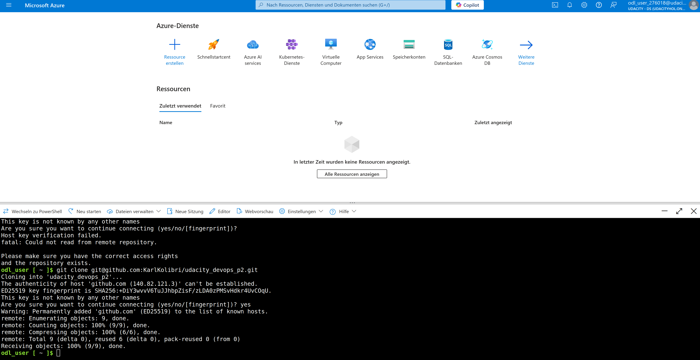
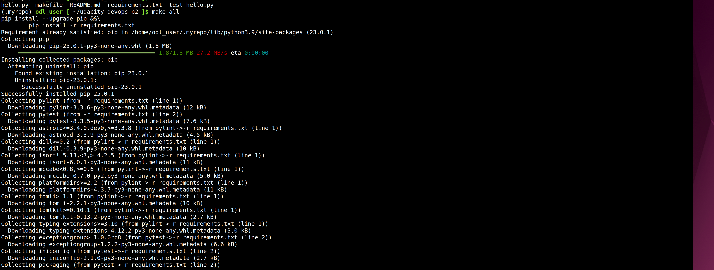
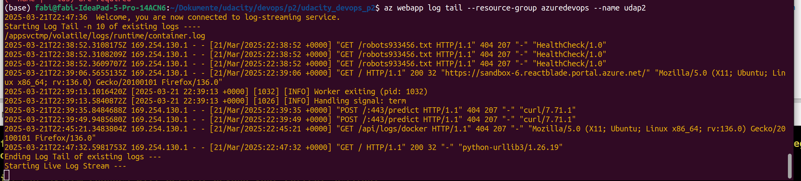
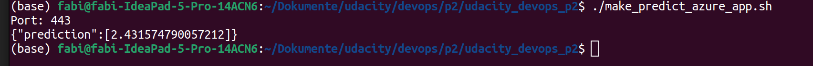

# Overview

A flask machine learning App will be deployed to Azure web services using CI/CD.

## Project Plan

You can find the Trelloboard here: [Trello](https://trello.com/b/kBa343ig/udacitydevopsp2)

The spreadsheet can be found in this repo.

[Youtube Link](https://youtu.be/y3e3VEPMf1c)

# Architecture Overview


# Images
Here are the evidence screenshots made along the development process:

## Cloned Git in AZ Shell


## Make all output


## Succesfull Build 


## Webapp Logs


## Webapp Prediction


# Azure Deployment Instructions

## Setup Azure Cloud Shell

1.  **SSH Key Pair:**
    ```bash
    ssh-keygen -t rsa
    cat ~/.ssh/id_rsa.pub # Copy output to GitHub (Settings > SSH and GPG keys)
    ```
2.  **Clone Repository:**
    ```bash
    git clone git@github.com:<your-git>/udacity-p2.git
    ```
3.  **Virtual Environment:**
    ```bash
    python3 -m venv ~/.udacity-p2
    source ~/.udacity-p2/bin/activate
    ```
4.  **Install & Deploy:**
    ```bash
    make all
    az webapp up -n <your-app-name> -l eastus --sku B1
    ```
    (Replace `<your-app-name>`. Update `make_predict_azure_app.sh` with your app URL.)

## Configure GitHub Actions

1.  **Create Workflow:**
    GitHub > Actions > New workflow > Copy/paste the following:
    ```yaml
    name: Python application test with Github Actions
    on: [push]
    jobs:
      build:
        runs-on: ubuntu-latest
        steps:
          - uses: actions/checkout@v2
          - name: Set up Python 3.10
            uses: actions/setup-python@v1
            with:
              python-version: 3.10
          - name: Install dependencies
            run: make install
          - name: Lint with pylint
            run: make lint
          - name: Test with pytest
            run: make test
    ```

## Configure Azure Pipeline

Follow [Microsoft documentation](https://docs.microsoft.com/en-us/azure/devops/pipelines/ecosystems/python-webapp?view=azure-devops).


## Enhancements
In the future we could use IaaC such as Terraform to better adhere to DevOps principles.
## Demo 

Please find the demo here [Video-Link](https://streamable.com/4ksd2r)


